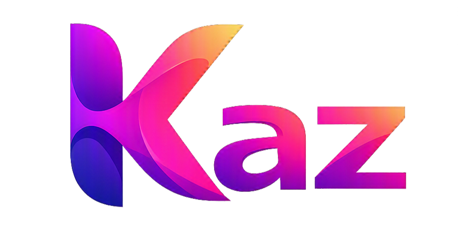

# Kaz 🦅
### A Modern, High-Performance Typed Programming Language

<p align="center">
    
</p>

<p align="center">
    <a href="https://github.com/armandosds/Kaz"></a>
    <a href="LICENSE"></a>
    
    
    
    <a href="https://www.rust-lang.org/"></a>
</p>

---

## 🚀 Sobre a Linguagem

**Kaz** é uma linguagem de programação moderna, fortemente tipada e inspirada em **Rust**, projetada para aliar máxima clareza sintática, segurança estrita de tipos e altíssimo desempenho de execução.

Construída do zero com uma **Máquina Virtual de Bytecode baseada em Pilha (Stack VM)**, Kaz é uma plataforma completa que inclui compilador nativo, sistema de módulos multi-arquivos com resolução de dependências em pastas, banco de dados relacional **SQLite embutido no próprio executável**, cliente HTTP/REST, parser JSON, terminal interativo integrado, formatador canônico de código com validação de AST e **extensão oficial de coloração sintática para Lumina IDE e VS Code**.

> 🔒 **Licença & Propriedade Intelectual**: Software proprietário com desenvolvimento sob controle fechado. Todos os direitos reservados © 2026 Armando Soares. Não são permitidos *forks*, clonagens não autorizadas ou criação de variantes derivadas sem autorização prévia formal por escrito.

---

## ✨ Destaques & Diferenciais

- ⚡ **Stack Bytecode Virtual Machine**: Código compilado diretamente para sequências lineares de `OpCode`, com variáveis locais mapeadas em offsets de memória fixos (até **27x mais rápida** que interpretadores AST tradicionais).
- 🏷️ **Enums com Dados (Tagged Unions) & Pattern Matching (`match`)**: Modelagem de tipos algébricos com dados associados (`enum Resultado { Sucesso(int), Falha(string) }`) e desestruturação de alta performance via `match` com vinculação de variáveis, literais e curinga (`_`).
- 🔢 **Operadores Bitwise & Literais Hex/Bin/Null**: Operações de baixo nível (`&`, `|`, `^`, `~`, `<<`, `>>`), atribuições compostas (`&=`, `|=`, `^=`, `<<=`, `>>=`), literais hexadecimais (`0x...`), binários (`0b...`) e literal `null`.
- 📚 **4 Pilares Fundamentais da Stdlib**: Matemática absoluta (`abs`, `floor`, `ceil`, `round`, `min`, `max`, `sqrt`, `pow`), fatiamento e manipulação de arrays (`slice`, `join`, `size()`, índices negativos), transformações de texto (`trim`, `toUpperCase`, `toLowerCase`, `replace`) e busca/filtro (`indexOf`, `find`, `includes`, `contains`, `startsWith`, `endsWith`).
- ✍️ **Convenção camelCase & Saída runoff()**: Padronização canônica da linguagem (`camelCase` para funções e variáveis, `PascalCase` para enums/structs) e saída oficial `runoff(...)`.
- 🚀 **Compilador Nativo Cranelift JIT & AOT (`kaz jit` / `kaz build`)**: Compilação direta para código de máquina x86_64, alcançando paridade de **~1,9x do Rust Nativo (-O3)** no Linux e **~2,5x** no Windows, superando interpretadores em até **39x**.
- 🧠 **Gerenciamento de Memória Nativo (ARC + Slab Free-List)**: Alocação com Bump Arena e reciclagem instantânea de structs em cache L1 através de Free-List segmentada, eliminando pausas de Garbage Collector e sobrecarga de `malloc`.
- ⚡ **Intrínsecos de CPU**: Funções matemáticas de alta frequência (como `math.sqrt`) emitem diretamente a instrução de hardware da FPU (`sqrtsd`) sem overhead de FFI.
- 📁 **Projetos Estruturados em Pastas (`import`)**: Crie softwares modulares com subpastas (`models/`, `db/`, `services/`) e caminhos relativos. Execute a aplicação inteira com um único comando: `kaz meu_projeto/`.
- 📐 **Formatador Canônico Integrado (`kaz fmt`)**: Padronizador de código com estilo K&R/1TBS, 4 espaços de indentação, suporte a modo `--check` para pipelines de CI/CD e validação de AST de segurança para garantir integridade.
- 🗄️ **SQLite Embutido Nativo (`db.*`)**: Motor de banco de dados relacional compilado estaticamente dentro de `kaz.exe`. Execute `db.open()`, `db.execute()` e `db.query()` sem instalar nenhum driver ou DLL externa.
- 🔄 **Serialização & Parsing JSON (`json.*`)**: `json.parse()` e `json.stringify()` integrados nativamente com tipagem estruturada.
- 🌐 **Rede e HTTP REST (`net.*`)**: Medição de latência TCP real (`net.ping`), clientes HTTP GET/POST e sockets de rede nativos.
- 🔒 **Sistema de Tipagem Seguro**: Tipos primitivos (`int`, `float`, `string`, `char`, `bool`), estruturas compostas (`struct`), união de enums (`enum`), arrays dinâmicos tipados (`array[string]`, `array[int]`, `array[any]`) e constantes imutáveis (`const`).
- 🔄 **Loops Modernos & Aninhados**: Suporte nativo a laços aninhados profundos, iteração com `for (item in colecao)`, `for (i in colecao.indices)`, `while` e `for` clássico de 3 cláusulas.
- 🔀 **Operador Ternário (`? :`)**: Expressões condicionais compactas com suporte a aninhamento.
- 🖥️ **Kaz Terminal Interativo & REPL**: Shell de comando que emula o terminal do sistema operacional (`ls`, `cd`, `run`, `env`) ao mesmo tempo em que executa comandos Kaz em tempo real.
- 🎨 **Extensão Oficial para IDEs**: Pacote VSIX com suporte a sintaxe, escopos TextMate e snippets inteligentes para a **Lumina IDE** e o **VS Code**.

---

## ⚡ Começando em 60 Segundos

### 1. Criar o primeiro arquivo:
Crie um arquivo chamado `ola.kaz`:
```kaz
function Main() {
    runoff("Olá, mundo! Kaz está funcionando com força total 🦅");
}
```

### 2. Executar:
```bash
kaz ola.kaz
```

### 3. Criar um projeto completo estruturado:
```bash
kaz new meusistema
cd meusistema
kaz run .
kaz test
```

---

## 🧩 Exemplo de Software Modular em Kaz

Kaz permite organizar softwares corporativos reais em pastas. Abaixo um exemplo de projeto estruturado com banco de dados SQLite e JSON:

```text
meu_sistema/
├── models/
│   └── usuario.kaz       # Estruturas de dados tipadas
├── db/
│   └── sqlite_repo.kaz   # Conexão e queries SQL
└── main.kaz              # Ponto de entrada do sistema
```

#### `models/usuario.kaz`:
```kaz
struct Usuario {
    int id;
    string nome;
    bool ativo;
}
```

#### `main.kaz`:
```kaz
import "models/usuario.kaz";

function Main() {
    // Abre banco SQLite em memória ou em arquivo
    int conn = db.open(":memory:");
    db.execute(conn, "CREATE TABLE usuarios (id INTEGER PRIMARY KEY, nome TEXT, ativo INTEGER);");
    db.execute(conn, "INSERT INTO usuarios (nome, ativo) VALUES ('Armando Soares', 1);");

    // Consulta SQL e mapeia diretamente para os campos
    array[any] linhas = db.query(conn, "SELECT id, nome, ativo FROM usuarios;");
    for (linha in linhas) {
        string status = (linha.ativo == 1) ? "ATIVO ✔" : "INATIVO ❌";
        runoff("Usuário [" + linha.id + "]: " + linha.nome + " - " + status);
    }

    db.close(conn);
}
```

Para executar o projeto inteiro:
```bash
kaz meu_sistema/
```

---

## 🛠️ Compilação e Instalação

### Pré-requisitos
- [Rust & Cargo](https://rustup.rs/) (Edição 2024 ou superior)

### 1. Compilação a partir do Código-Fonte
```bash
cargo build --release
```
O executável otimizado estará localizado em `target/release/kaz.exe` (Windows) ou `target/release/kaz` (Linux/macOS).

### 2. Instalação Automática

#### No Windows (PowerShell):
```powershell
.\install.ps1
```
*O script compila o projeto, copia o binário para o diretório de ferramentas do usuário, configura o `PATH` do sistema e instala a extensão na Lumina IDE e no VS Code automaticamente.*

#### No Linux / macOS:
```bash
chmod +x install.sh
./install.sh
```

### 3. Desinstalação Limpa (Clean Uninstall)
Para remover completamente a linguagem Kaz, os binários, o registro no `PATH` e as extensões de IDEs do sistema:

#### No Windows:
Dê um duplo-clique em **`uninstall.bat`** ou execute no PowerShell:
```powershell
.\uninstall.ps1
```

#### No Linux / macOS:
```bash
chmod +x uninstall.sh
./uninstall.sh
```

---

## 📖 Como Usar a CLI

```bash
# Executar script individual na Máquina Virtual de Bytecode
kaz programa.kaz
kaz run programa.kaz

# Executar suíte de testes unitários nativos
kaz test
kaz test testes/
kaz test meu_arquivo.kaz

# Ferramentas de diagnóstico e depuração nativas
kaz trace programa.kaz    # Rastreia a Stack VM passo a passo com a pilha em tempo real
kaz debug programa.kaz    # Desmonta o bytecode e exibe constantes e chunks
kaz db-cli meu_banco.db   # Abre console SQL interativo para inspecionar o SQLite

# Executar projeto modular em pasta (procura automaticamente main.kaz)
kaz pasta_do_projeto/
kaz .

# Verificar sintaxe sem executar
kaz check programa.kaz

# Formatar código no padrão canônico Kaz
kaz fmt src/
kaz fmt programa.kaz
kaz fmt src/ --check      # Modo verificação para CI/CD

# Iniciar o Kaz Terminal interativo
kaz shell
# ou simplesmente iniciar sem argumentos:
kaz

# Iniciar o REPL simples
kaz repl

# Forçar execução no interpretador clássico AST
kaz ast programa.kaz

# Consultar ajuda e versão
kaz --help
kaz --version
```

---

## 📊 Benchmarks Oficiais & Comparativo de Desempenho

Kaz possui backend nativo de alta performance baseado em **Cranelift JIT** (`kaz jit`) e **AOT ELF** (`kaz build`), alcançando paridade direta com binários compilados em **Rust (-O3)** e superando interpretadores dinâmicos como **Python 3.14** em até **39x**.

### Resumo Comparativo: Linux vs Windows (Suíte Geral Integrada)

Medições em microssegundos ($\mu$s) no mesmo hardware Intel @ 2.60 GHz:

| Teste / Operação | Rust Nativo (-O3) [Linux] | **Kaz JIT [Linux]** | Python 3.14 [Linux] | Rust Nativo (-O3) [Windows] | **Kaz JIT [Windows]** | Python 3.12 [Windows] |
|---|:---:|:---:|:---:|:---:|:---:|:---:|
| **1. Recursão (Fibonacci 26)** | 537 $\mu$s | **995 $\mu$s** | 38.083 $\mu$s | 492 $\mu$s | **1.197 $\mu$s** | 38.422 $\mu$s |
| **2. Loop Aritmético (50k ops)** | 111 $\mu$s | **171 $\mu$s** | 8.714 $\mu$s | 94 $\mu$s | **145 $\mu$s** | 8.454 $\mu$s |
| **3. Structs & Sqrt (10k instâncias)** | 98 $\mu$s | **234 $\mu$s** | 9.068 $\mu$s | 55 $\mu$s | **280 $\mu$s** | 6.350 $\mu$s |
| **TEMPO TOTAL DA SUÍTE** | **747 $\mu$s** (0,75 ms) | **1.419 $\mu$s** (1,4 ms) | **55.870 $\mu$s** (55,9 ms) | **642 $\mu$s** (0,64 ms) | **1.622 $\mu$s** (1,6 ms) | **53.226 $\mu$s** (53,2 ms) |
| **Paridade Geral com Rust** | — | **~1,9x do Rust** | — | — | **~2,5x do Rust** | — |
| **Aceleração vs Python** | — | **~39x mais rápido** | — | — | **~33x mais rápido** | — |

### Relatórios Completos e Verificações Teóricas:
- 🐧 **[Relatório de Benchmarks no Linux x86_64](BENCHMARKS_LINUX.md)**: Paridade simétrica com Python 3.14, Rust -O3 e Kaz VM.
- 🪟 **[Relatório de Benchmarks no Windows 11](BENCHMARKS.md)**: Prova assintótica anti-constant folding $O(\phi^n)$ e mitigação de LICM.
- ⚡ **[Relatório Técnico de Otimizações & ARC](benches/RELATORIO_OTIMIZACOES_PERFORMANCE.md)**: Detalhamento do Bump Arena, Slab Free-List e opcode nativo `sqrtsd`.
- 📁 **[Código-Fonte dos Benchmarks & Reprodução](benches/)**: Scripts em Kaz, Rust e Python para auditoria e replicação independente.

---

## 📁 Catálogo de Exemplos Práticos

Consulte o diretório [`examples/`](examples/) para explorar exemplos completos e funcionais:

| Arquivo de Exemplo | Conceito Demonstrado |
|---|---|
| [`examples/enums_and_match.kaz`](examples/enums_and_match.kaz) | **Enums & Pattern Matching**: Tagged Unions, variantes com dados, literais e `match` |
| [`examples/test_four_pillars.kaz`](examples/test_four_pillars.kaz) | **4 Pilares da Stdlib**: Matemática absoluta, fatiamento de arrays, texto e busca |
| [`examples/test_bitwise_null.kaz`](examples/test_bitwise_null.kaz) | **Operadores Bitwise & Null**: Bitwise (`&`, `|`, `^`, `~`, `<<`, `>>`) e literais hex/bin/null |
| [`examples/battery_included_demo.kaz`](examples/battery_included_demo.kaz) | **Bateria Inclusa Completa**: Testes nativos `test`, criptografia `crypto.*`, regex `regex.*` e arquivos `fs.*` |
| [`examples/project_structure_demo/`](examples/project_structure_demo/) | **Aplicação Corporativa Modular** (Pastas `models/`, `db/`, `services/`, SQLite e JSON) |
| [`examples/kaz_net_dashboard.kaz`](examples/kaz_net_dashboard.kaz) | Painel de monitoramento TCP e ping em tempo real |
| [`examples/benchmark.kaz`](examples/benchmark.kaz) | Suíte de testes de estresse e medição de desempenho da Stack VM |
| [`examples/arrays_typed_and_for_in.kaz`](examples/arrays_typed_and_for_in.kaz) | Arrays tipados, loops `for..in`, propriedades `.indices` e ternário |
| [`examples/structs.kaz`](examples/structs.kaz) | Definição de structs, mutação de campos e coleções de tipos compostos |
| [`examples/complete_app.kaz`](examples/complete_app.kaz) | Sistema de Gestão Acadêmica com funções e controle de fluxo |
| [`examples/stdlib_demo.kaz`](examples/stdlib_demo.kaz) | Demonstração de E/S, arquivos, matemática e strings |
| [`examples/hello.kaz`](examples/hello.kaz) | Olá Mundo e noções básicas |

---

## 🧪 Testes Automatizados

Kaz possui uma suíte rigorosa de **125+ testes automatizados** cobrindo todas as áreas da linguagem com zero regressão:

```bash
cargo test
```

### Áreas Cobertas:
- Enums com dados (Tagged Unions) e Pattern Matching (`enum_match_tests.rs`)
- Operadores bitwise e literal null (`bitwise_null_tests.rs`)
- Os 4 Pilares da biblioteca padrão (`method_tests.rs`)
- Formatador canônico automático de código e integridade de AST (`fmt_tests.rs`)
- Tratamento robusto de erros com desenrolamento de pilha (`try_catch_tests.rs`)
- Testes unitários integrados e asserções nativas (`native_test_runner_tests.rs`)
- Criptografia padrão SHA256, MD5 e Base64 (`crypto_tests.rs`)
- Expressões regulares nativas (`regex_tests.rs`)
- Manipulação avançada de sistema de arquivos (`fs_expansion_tests.rs`)
- Sistema de tipos e constantes (`variable_tests.rs`, `typed_array_tests.rs`)
- Operadores e precedência (`operator_tests.rs`, `ternary_tests.rs`)
- Estruturas de controle de fluxo (`control_flow_tests.rs`, `for_in_tests.rs`)
- Funções, escopo léxico e recursão (`function_tests.rs`)
- Structs e mutação de campos (`struct_tests.rs`)
- Módulos multi-arquivos e proteção anti-ciclo (`import_tests.rs`)
- Banco de dados relacional SQLite (`db_tests.rs`)
- Serialização e parsing JSON (`json_tests.rs`)
- Conectividade de rede TCP e HTTP (`net_tests.rs`)
- Máquina Virtual de Bytecode (`vm_tests.rs`)
- Interface de linha de comando (`cli_tests.rs`, `shell_tests.rs`)

---

## 📚 Documentação Técnica Completa

Para aprofundar-se em cada aspecto da linguagem, consulte os manuais especializados em [`docs/`](docs/):

- 📖 **[Guia Oficial da Linguagem (Language Guide)](docs/LANGUAGE_GUIDE.md)**: Manual sintático completo, regras de tipagem, controle de fluxo e structs.
- 📚 **[Referência da Biblioteca Padrão (Stdlib)](docs/STDLIB.md)**: Catálogo com todas as funções nativas de E/S, matemática, strings, SQLite, JSON e rede.
- 🖥️ **[Manual da CLI e Kaz Terminal](docs/CLI_GUIDE.md)**: Comandos de terminal, flags de execução e recursos do shell interativo.
- 🏛️ **[Arquitetura Interna do Compilador e VM](docs/ARCHITECTURE.md)**: Detalhes do pipeline de compilação, Pratt parser, opcodes e motor de despacho da VM.

---

## 📄 Licença e Propriedade Intelectual

**Software Proprietário — Todos os Direitos Reservados © 2026 Armando Soares.**  
O código-fonte e binários são disponibilizados exclusivamente para visualização e uso pessoal autorizado. É expressamente proibida qualquer forma de bifurcação (*fork*), engenharia reversa para variantes derivadas, distribuição de cópias não autorizadas ou comercialização sem o consentimento prévio formal por escrito do detentor dos direitos autorais.
