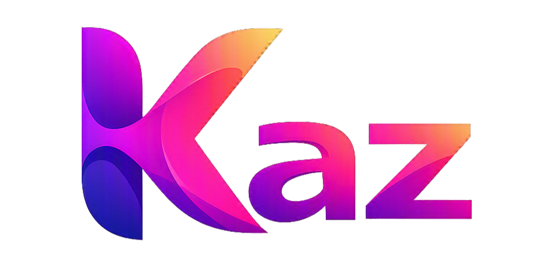

# Kaz 🦅
### A Modern, High-Performance Typed Programming Language

<p align="center">
    
</p>

<p align="center">
    <a href="https://github.com/armandosds/Kaz"></a>
    <a href="CHANGELOG.md"></a>
    <a href="LICENSE"></a>
    
    
    
    <a href="https://www.rust-lang.org/"></a>
</p>

<p align="center">
    <b>🌐 Language / Idioma:</b>
    <a href="#-about-the-language"><b>English</b></a> |
    <a href="#-versão-em-português"><b>Português</b></a> |
    <a href="README.pt-BR.md"><b>README.pt-BR.md</b></a>
</p>

---

## 🚀 About the Language

**Kaz** is a modern, strongly-typed programming language inspired by **Rust**, engineered to balance syntactic ergonomics, strict type safety, and blazing-fast execution performance.

Built from scratch with a **Stack-based Bytecode Virtual Machine (Stack VM)**, Kaz provides a complete developer platform: a native compiler, a multi-file module system with folder-based dependency resolution, an **embedded SQLite relational database engine built directly into the binary**, an HTTP/REST client, a JSON parser, an interactive built-in terminal, a canonical code formatter with AST safety validation, and **official syntax highlighting extensions for Lumina IDE and VS Code**.

> 🔒 **Proprietary License & Intellectual Property**: Closed-source proprietary software. All rights reserved © 2026 Armando Soares. Unauthorized forks, cloning, redistribution, or creation of derivative variants without prior written consent are strictly prohibited.

---

## ✨ Features & Highlights

- 🏗️ **Automated Project Scaffolding (`kaz new` / `kaz create`)**: Instantly bootstrap production-ready projects with standard folder architecture, embedded SQLite database, typed models adhering to `camelCase` conventions, native automated tests, and `kaz.json` manifest.
- ⚡ **Stack Bytecode Virtual Machine**: Code compiles into compact linear `OpCode` streams with local variables mapped to fixed stack offsets (up to **27x faster** than traditional tree-walk interpreters).
- 🏷️ **Enums with Data (Tagged Unions) & Pattern Matching (`match`)**: Algebraic data types with associated payloads (`enum Result { Success(int), Failure(string) }`) and high-performance destructuring via `match` with variable binding, literal matching, and wildcards (`_`).
- 🔢 **Bitwise Operators & Hex/Bin/Null Literals**: Low-level bitwise operations (`&`, `|`, `^`, `~`, `<<`, `>>`), compound assignments (`&=`, `|=`, `^=`, `<<=`, `>>=`), hexadecimal (`0x...`), binary (`0b...`), and `null` literals.
- 📚 **The 4 Fundamental Pillars of the Stdlib**: Absolute math (`abs`, `floor`, `ceil`, `round`, `min`, `max`, `sqrt`, `pow`), array slicing & manipulation (`slice`, `join`, `size()`, negative indices), text transformations (`trim`, `toUpperCase`, `toLowerCase`, `replace`), and search/filtering (`indexOf`, `find`, `includes`, `contains`, `startsWith`, `endsWith`).
- ✍️ **camelCase Standard & runoff() Output**: Canonical language conventions (`camelCase` for functions and variables, `PascalCase` for structs/enums) and official output via `runoff(...)`.
- 🚀 **Native Cranelift JIT & AOT Compiler (`kaz jit` / `kaz build`)**: Direct machine code generation for x86_64, reaching **~1.9x Native Rust (-O3)** parity on Linux and **~2.5x** on Windows, outperforming dynamic interpreters like Python 3.14 by up to **39x**.
- 🧠 **Native Memory Architecture (ARC + Slab Free-List)**: Bump Arena allocation and instant struct recycling in L1 cache via segmented Free-Lists, eliminating garbage collection pauses and `malloc` overhead.
- ⚡ **Direct CPU Intrinsics**: High-frequency mathematical functions (such as `math.sqrt`) emit hardware FPU instructions (`sqrtsd`) directly with zero FFI overhead.
- 📁 **Folder-Based Modular Projects (`import`)**: Build structured applications with subfolders (`models/`, `db/`, `services/`) and relative imports. Run an entire multi-file project with a single command: `kaz my_project/`.
- 📐 **Canonical Code Formatter (`kaz fmt`)**: Built-in 1TBS / K&R style code standardizer with 4 spaces, `--check` CI/CD verification mode, and AST safety validation to guarantee structural integrity.
- 🗄️ **Embedded SQLite Database (`db.*`)**: Statically bundled relational database engine within `kaz.exe`. Call `db.open()`, `db.execute()`, and `db.query()` out of the box with zero external drivers or DLL dependencies.
- 🔄 **JSON Serialization & Parsing (`json.*`)**: Native, type-safe `json.parse()` and `json.stringify()`.
- 🌐 **Networking & HTTP REST (`net.*`)**: Real TCP latency measurement (`net.ping`), native HTTP GET/POST clients, and TCP sockets.
- 🔒 **Type-Safe System**: Primitive types (`int`, `float`, `string`, `char`, `bool`), compound structs (`struct`), tagged unions (`enum`), typed dynamic arrays (`array[string]`, `array[int]`, `array[any]`), and immutable constants (`const`).
- 🔄 **Modern & Deeply Nested Loops**: Native support for nested loops, `for (item in collection)`, `for (i in collection.indices)`, `while`, and classic 3-clause `for`.
- 🔀 **Ternary Operator (`? :`)**: Compact conditional expressions with nested ternary support.
- 🖥️ **Interactive Kaz Terminal & REPL**: Built-in shell that emulates OS commands (`ls`, `cd`, `run`, `env`) while evaluating Kaz expressions in real time.
- 🎨 **Official IDE Extension**: Ready-to-use VSIX package with syntax highlighting, TextMate grammar scopes, and intelligent snippets for **Lumina IDE** and **VS Code**.

---

## ⚡ Quick Start in 60 Seconds

### Option 1: Create a full structured project (Recommended) 🚀
The fastest and cleanest way to start a new system with SQLite, data models, and automated tests:
```bash
kaz new mysystem
cd mysystem
kaz run .
kaz test
```

### Option 2: Run a standalone script
Create a file named `hello.kaz`:
```kaz
function main() {
    runoff("Hello, World! Kaz is running at full power 🦅");
}
```
Run it:
```bash
kaz hello.kaz
```

---

## 🏗️ Structured Projects & Scaffolding (`kaz new` / `kaz create`)

Running `kaz new mysystem` (or `kaz create mysystem`) automatically scaffolds the standard Kaz project layout:

```text
mysystem/
├── kaz.json             # Project configuration manifest
├── README.md            # Documentation and execution instructions
├── .gitignore           # Ignores *.db, bin/, dist/, and temporary files
├── data/
│   └── schema.sql       # DDL script with SQLite table schema
├── src/
│   ├── main.kaz         # Application entry point
│   ├── database.kaz     # SQLite connection and migration module
│   └── models/
│       └── usuario.kaz  # Domain model structs
└── tests/
    └── main_test.kaz    # Native automated unit tests
```

### Generated Project Code

#### `src/models/usuario.kaz`:
```kaz
struct Usuario {
    int id;
    string nome;
    string email;
}

function criarUsuario(int id, string nome, string email): Usuario {
    return Usuario {
        id: id,
        nome: nome,
        email: email
    };
}

function formatarUsuario(any u): string {
    return "[" + u.id + "] " + u.nome + " <" + u.email + ">";
}
```

#### `src/database.kaz`:
```kaz
import "models/usuario.kaz";

function inicializarBanco(string caminhoDb): int {
    fs_mkdir("data");
    int conn = db_open(caminhoDb);
    db_execute(conn, "CREATE TABLE IF NOT EXISTS usuarios (id INTEGER PRIMARY KEY AUTOINCREMENT, nome TEXT NOT NULL, email TEXT NOT NULL UNIQUE);");
    return conn;
}

function inserirUsuario(int conn, string nome, string email): int {
    return db_execute(conn, "INSERT OR IGNORE INTO usuarios (nome, email) VALUES (?, ?);", [nome, email]);
}

function listarUsuarios(int conn): array {
    return db_query(conn, "SELECT id, nome, email FROM usuarios ORDER BY id ASC;");
}
```

#### `src/main.kaz`:
```kaz
import "database.kaz";
import "models/usuario.kaz";

function main() {
    runoff("============================================");
    runoff("  🦅 Welcome to Kaz System!");
    runoff("============================================");

    string caminhoDb = "data/app.db";
    int conn = inicializarBanco(caminhoDb);

    inserirUsuario(conn, "Kaz Dev", "dev@kazlang.org");
    inserirUsuario(conn, "Ada Lovelace", "ada@computing.org");

    array usuarios = listarUsuarios(conn);
    runoff("-> Total users: " + len(usuarios));

    for (u in usuarios) {
        runoff("   " + formatarUsuario(u));
    }

    db_close(conn);
}
```

To run the entire project:
```bash
kaz run .
# or from any parent folder:
kaz mysystem/
```

---

## 🛠️ Building & Installation

### Prerequisites
- [Rust & Cargo](https://rustup.rs/) (Edition 2024 or higher)

### 1. Compiling from Source
```bash
cargo build --release
```
The optimized executable will be located at `target/release/kaz.exe` (Windows) or `target/release/kaz` (Linux/macOS).

### 2. Automated Installation

#### On Windows (PowerShell):
```powershell
.\install.ps1
```
*Compiles the project, installs the binary to the user tool directory, registers `kaz` in the system `PATH`, and automatically installs the syntax extension for Lumina IDE and VS Code.*

#### On Linux / macOS:
```bash
chmod +x install.sh
./install.sh
```

### 3. Clean Uninstall
To completely remove Kaz binaries, system `PATH` entries, and IDE extensions:

#### On Windows:
Double-click **`uninstall.bat`** or run in PowerShell:
```powershell
.\uninstall.ps1
```

#### On Linux / macOS:
```bash
chmod +x uninstall.sh
./uninstall.sh
```

---

## 📖 CLI Usage Guide

```bash
# Execute a standalone script on the Stack Bytecode VM
kaz program.kaz
kaz run program.kaz

# Compile to portable binary bytecode (.kzc)
kaz compile program.kaz -o output.kzc

# Execute precompiled binary bytecode directly on the Stack VM
kaz run output.kzc

# Run the native unit test suite
kaz test
kaz test tests/
kaz test my_file.kaz

# Diagnostic and debugging tools
kaz trace program.kaz     # Traces Stack VM execution step-by-step with real-time stack view
kaz debug program.kaz     # Disassembles bytecode chunks, instructions, and constants table
kaz db-cli my_database.db # Interactive SQL console to inspect SQLite databases

# Run a multi-file modular folder (automatically locates main.kaz)
kaz project_folder/
kaz .

# Validate syntax without executing
kaz check program.kaz

# Format code to Kaz canonical standard (1TBS, 4 spaces)
kaz fmt src/
kaz fmt program.kaz
kaz fmt src/ --check       # Verification mode for CI/CD pipelines

# Launch the interactive Kaz Terminal
kaz shell
# or simply launch without arguments:
kaz

# Launch simple REPL
kaz repl

# Force execution on the classic AST interpreter
kaz ast program.kaz

# View help and version
kaz --help
kaz --version
```

---

## 📊 Official Benchmarks & Performance Comparison

Kaz features a high-performance native backend powered by **Cranelift JIT** (`kaz jit`) and **AOT ELF** (`kaz build`), reaching direct parity with **Rust (-O3)** compiled binaries and outperforming dynamic interpreters such as **Python 3.14** by up to **39x**.

### Comparative Summary: Linux vs Windows (Integrated Benchmark Suite)

Measurements in microseconds ($\mu$s) on identical Intel @ 2.60 GHz hardware:

| Benchmark / Operation | Native Rust (-O3) [Linux] | **Kaz JIT [Linux]** | Python 3.14 [Linux] | Native Rust (-O3) [Windows] | **Kaz JIT [Windows]** | Python 3.12 [Windows] |
|---|:---:|:---:|:---:|:---:|:---:|:---:|
| **1. Recursion (Fibonacci 26)** | 537 $\mu$s | **995 $\mu$s** | 38,083 $\mu$s | 492 $\mu$s | **1,197 $\mu$s** | 38,422 $\mu$s |
| **2. Arithmetic Loop (50k ops)** | 111 $\mu$s | **171 $\mu$s** | 8,714 $\mu$s | 94 $\mu$s | **145 $\mu$s** | 8,454 $\mu$s |
| **3. Structs & Sqrt (10k instances)** | 98 $\mu$s | **234 $\mu$s** | 9,068 $\mu$s | 55 $\mu$s | **280 $\mu$s** | 6,350 $\mu$s |
| **TOTAL SUITE TIME** | **747 $\mu$s** (0.75 ms) | **1,419 $\mu$s** (1.4 ms) | **55,870 $\mu$s** (55.9 ms) | **642 $\mu$s** (0.64 ms) | **1,622 $\mu$s** (1.6 ms) | **53,226 $\mu$s** (53.2 ms) |
| **Overall Parity with Rust** | — | **~1.9x of Rust** | — | — | **~2.5x of Rust** | — |
| **Speedup vs Python** | — | **~39x faster** | — | — | **~33x faster** | — |

### Full Reports & Theoretical Verifications:
- 🐧 **[Linux x86_64 Benchmark Report](BENCHMARKS_LINUX.md)**: Symmetric parity with Python 3.14, Rust -O3, and Kaz VM.
- 🪟 **[Windows 11 Benchmark Report](BENCHMARKS.md)**: Asymptotic proof against constant folding $O(\phi^n)$ and LICM mitigation.
- ⚡ **[ARC & Optimization Technical Report](benches/RELATORIO_OTIMIZACOES_PERFORMANCE.md)**: Bump Arena, Slab Free-List, and native `sqrtsd` opcode architecture.
- 📁 **[Benchmark Source Code & Reproduction](benches/)**: Scripts in Kaz, Rust, and Python for independent replication and audit.

---

## 📁 Practical Examples Catalog

Browse the [`examples/`](examples/) directory for complete, runnable code:

| Example File | Demonstrated Concepts |
|---|---|
| [`examples/enums_and_match.kaz`](examples/enums_and_match.kaz) | **Enums & Pattern Matching**: Tagged Unions, payload variants, literals, and `match` |
| [`examples/test_four_pillars.kaz`](examples/test_four_pillars.kaz) | **4 Pillars of Stdlib**: Absolute math, array slicing, text manipulation, and search |
| [`examples/test_bitwise_null.kaz`](examples/test_bitwise_null.kaz) | **Bitwise & Null**: Bitwise operators (`&`, `|`, `^`, `~`, `<<`, `>>`) and hex/bin/null literals |
| [`examples/battery_included_demo.kaz`](examples/battery_included_demo.kaz) | **Batteries Included**: Built-in unit `test`, `crypto.*`, `regex.*`, and `fs.*` |
| [`examples/project_structure_demo/`](examples/project_structure_demo/) | **Modular Enterprise Architecture** (`models/`, `db/`, `services/`, SQLite, and JSON) |
| [`examples/kaz_net_dashboard.kaz`](examples/kaz_net_dashboard.kaz) | Real-time TCP network monitoring and latency ping dashboard |
| [`examples/benchmark.kaz`](examples/benchmark.kaz) | Stress-testing suite and Stack VM performance benchmarking |
| [`examples/arrays_typed_and_for_in.kaz`](examples/arrays_typed_and_for_in.kaz) | Typed arrays, `for..in` loops, `.indices` property, and ternary operator |
| [`examples/structs.kaz`](examples/structs.kaz) | Struct definitions, field mutation, and typed compound collections |
| [`examples/complete_app.kaz`](examples/complete_app.kaz) | Academic Management System featuring functions and control flow |
| [`examples/stdlib_demo.kaz`](examples/stdlib_demo.kaz) | Standard library demonstration: I/O, filesystem, math, and strings |
| [`examples/hello.kaz`](examples/hello.kaz) | Hello World and language fundamentals |

---

## 🧪 Automated Testing Suite

Kaz maintains a rigorous test suite of **125+ automated tests** verifying every language layer with zero regressions:

```bash
cargo test
```

### Coverage Areas:
- Enums with data (Tagged Unions) and Pattern Matching (`enum_match_tests.rs`)
- Bitwise operators and null literal (`bitwise_null_tests.rs`)
- The 4 Pillars of the standard library (`method_tests.rs`)
- Canonical code formatter and AST safety validation (`fmt_tests.rs`)
- Robust error handling with stack unwinding (`try_catch_tests.rs`)
- Built-in test runner and native assertions (`native_test_runner_tests.rs`)
- Cryptography: SHA256, MD5, and Base64 (`crypto_tests.rs`)
- Native regular expressions (`regex_tests.rs`)
- Advanced filesystem manipulation (`fs_expansion_tests.rs`)
- Type system and immutable constants (`variable_tests.rs`, `typed_array_tests.rs`)
- Operators and precedence (`operator_tests.rs`, `ternary_tests.rs`)
- Control flow structures and loops (`control_flow_tests.rs`, `for_in_tests.rs`)
- Functions, lexical scoping, and deep recursion (`function_tests.rs`)
- Structs and field mutation (`struct_tests.rs`)
- Multi-file module imports and anti-cycle protection (`import_tests.rs`)
- Embedded SQLite database engine (`db_tests.rs`)
- JSON serialization and parsing (`json_tests.rs`)
- TCP and HTTP network client (`net_tests.rs`)
- Stack Bytecode Virtual Machine (`vm_tests.rs`)
- CLI command-line interface & interactive shell (`cli_tests.rs`, `shell_tests.rs`)

---

## 📚 Technical Documentation

Explore the comprehensive manuals inside the [`docs/`](docs/) directory:

- 📖 **[Official Language Guide](docs/LANGUAGE_GUIDE.md)**: Full syntax specification, type rules, control flow, and structs.
- 📚 **[Standard Library Reference (Stdlib)](docs/STDLIB.md)**: Catalog of native functions: I/O, math, strings, SQLite, JSON, and networking.
- 🖥️ **[CLI & Kaz Terminal Guide](docs/CLI_GUIDE.md)**: Terminal commands, execution flags, and interactive shell features.
- 🏛️ **[Compiler & VM Architecture](docs/ARCHITECTURE.md)**: Compilation pipeline, Pratt parsing, opcode design, and VM dispatch loop.
- 🦅 **[Milestone 3: Self-Hosted Compiler Report](docs/RELATORIO_MILESTONE_3_SELF_HOSTED.md)**: Technical breakdown, bootstrap verification, and Windows execution guide.

---

## 📄 Proprietary License & Intellectual Property

**Proprietary Software — All Rights Reserved © 2026 Armando Soares.**  
The source code and binaries are provided exclusively for authorized personal evaluation and use. Forking, reverse engineering for derivative works, unauthorized redistribution, and commercial exploitation without prior formal written consent from the copyright holder are strictly prohibited.

---

# 🇧🇷 Versão em Português

---

## 🚀 Sobre a Linguagem

**Kaz** é uma linguagem de programação moderna, fortemente tipada e inspirada em **Rust**, projetada para aliar máxima clareza sintática, segurança estrita de tipos e altíssimo desempenho de execução.

Construída do zero com uma **Máquina Virtual de Bytecode baseada em Pilha (Stack VM)**, Kaz é uma plataforma completa que inclui compilador nativo, sistema de módulos multi-arquivos com resolução de dependências em pastas, banco de dados relacional **SQLite embutido no próprio executável**, cliente HTTP/REST, parser JSON, terminal interativo integrado, formatador canônico de código com validação de AST e **extensão oficial de coloração sintática para Lumina IDE e VS Code**.

> 🔒 **Licença & Propriedade Intelectual**: Software proprietário com desenvolvimento sob controle fechado. Todos os direitos reservados © 2026 Armando Soares. Não são permitidos *forks*, clonagens não autorizadas ou criação de variantes derivadas sem autorização prévia formal por escrito.

---

## ✨ Destaques & Diferenciais

- 🏗️ **Scaffolding de Projetos Automatizado (`kaz new` / `kaz create`)**: Criação instantânea de sistemas completos com arquitetura padrão em pastas, banco de dados SQLite embutido, modelos tipados com convenção `camelCase`, testes automatizados nativos e manifesto `kaz.json`.
- ⚡ **Stack Bytecode Virtual Machine**: Código compilado diretamente para sequências lineares de `OpCode`, com variáveis locais mapeadas em offsets de memória fixos (até **27x mais rápida** que interpretadores AST tradicionais).
- 🏷️ **Enums com Dados (Tagged Unions) & Pattern Matching (`match`)**: Modelagem de tipos algébricos com dados associados (`enum Resultado { Sucesso(int), Falha(string) }`) e desestruturação de alta performance via `match` com vinculação de variáveis, literais e curinga (`_`).
- 🔢 **Operadores Bitwise & Literais Hex/Bin/Null**: Operações de baixo nível (`&`, `|`, `^`, `~`, `<<`, `>>`), atribuições compostas (`&=`, `|=`, `^=`, `<<=`, `>>=`), literais hexadecimais (`0x...`), binários (`0b...`) e literal `null`.
- 📚 **4 Pilares Fundamentais da Stdlib**: Matemática absoluta (`abs`, `floor`, `ceil`, `round`, `min`, `max`, `sqrt`, `pow`), fatiamento e manipulação de arrays (`slice`, `join`, `size()`, índices negativos), transformações de texto (`trim`, `toUpperCase`, `toLowerCase`, `replace`) e busca/filtro (`indexOf`, `find`, `includes`, `contains`, `startsWith`, `endsWith`).
- ✍️ **Convenção camelCase & Saída runoff()**: Padronização canônica da linguagem (`camelCase` para funções e variáveis, `PascalCase` para enums/structs) e saída oficial `runoff(...)`.
- 🚀 **Compilador Nativo Cranelift JIT & AOT (`kaz jit` / `kaz build`)**: Compilação direta para código de máquina x86_64, alcançando paridade de **~1,9x do Rust Nativo (-O3)** no Linux e **~2,5x** no Windows, superando interpretadores em até **39x**.
- 🧠 **Gerenciamento de Memória Nativo (ARC + Slab Free-List)**: Alocação com Bump Arena e reciclagem instantânea de structs em cache L1 através de Free-List segmentada, eliminando pausas de Garbage Collector e sobrecarga de `malloc`.
- ⚡ **Intrínsecos de CPU**: Funções matemáticas de alta frequência (como `math.sqrt`) emitem diretamente a instrução de hardware da FPU (`sqrtsd`) sem overhead de FFI.
- 📁 **Projetos Estruturados em Pastas (`import`)**: Crie softwares modulares com subpastas (`models/`, `db/`, `services/`) e caminhos relativos. Execute a aplicação inteira com um único comando: `kaz meu_projeto/`.
- 📐 **Formatador Canônico Integrado (`kaz fmt`)**: Padronizador de código com estilo K&R/1TBS, 4 espaços de indentação, suporte a modo `--check` para pipelines de CI/CD e validação de AST de segurança para garantir integridade.
- 🗄️ **SQLite Embutido Nativo (`db.*`)**: Motor de banco de dados relacional compilado estaticamente dentro de `kaz.exe`. Execute `db.open()`, `db.execute()` e `db.query()` sem instalar nenhum driver ou DLL externa.
- 🔄 **Serialização & Parsing JSON (`json.*`)**: `json.parse()` e `json.stringify()` integrados nativamente com tipagem estruturada.
- 🌐 **Rede e HTTP REST (`net.*`)**: Medição de latência TCP real (`net.ping`), clientes HTTP GET/POST e sockets de rede nativos.
- 🔒 **Sistema de Tipagem Seguro**: Tipos primitivos (`int`, `float`, `string`, `char`, `bool`), estruturas compostas (`struct`), união de enums (`enum`), arrays dinâmicos tipados (`array[string]`, `array[int]`, `array[any]`) e constantes imutáveis (`const`).
- 🔄 **Loops Modernos & Aninhados**: Suporte nativo a laços aninhados profundos, iteração com `for (item in colecao)`, `for (i in colecao.indices)`, `while` e `for` clássico de 3 cláusulas.
- 🔀 **Operador Ternário (`? :`)**: Expressões condicionais compactas com suporte a aninhamento.
- 🖥️ **Kaz Terminal Interativo & REPL**: Shell de comando que emula o terminal do sistema operacional (`ls`, `cd`, `run`, `env`) ao mesmo tempo em que executa comandos Kaz em tempo real.
- 🎨 **Extensão Oficial para IDEs**: Pacote VSIX com suporte a sintaxe, escopos TextMate e snippets inteligentes para a **Lumina IDE** e o **VS Code**.

---

## ⚡ Começando em 60 Segundos

### Opção 1: Criar um projeto completo estruturado (Recomendado) 🚀
O jeito mais rápido e profissional de iniciar um sistema em Kaz com banco de dados SQLite, modelos de dados e testes nativos:
```bash
kaz new meusistema
cd meusistema
kaz run .
kaz test
```

### Opção 2: Executar um script individual
Crie um arquivo chamado `ola.kaz`:
```kaz
function main() {
    runoff("Olá, mundo! Kaz está funcionando com força total 🦅");
}
```
E execute:
```bash
kaz ola.kaz
```

---

## 🏗️ Projetos Estruturados & Scaffold (`kaz new` / `kaz create`)

Ao executar `kaz new meusistema` (ou `kaz create meusistema`), Kaz gera automaticamente a estrutura de pastas recomendada pela comunidade, já integrada com banco de dados SQLite, modelos tipados e testes:

```text
meusistema/
├── kaz.json             # Manifesto de configuração do projeto
├── README.md            # Documentação e instruções de execução
├── .gitignore           # Ignora *.db, bin/, dist/ e temporários
├── data/
│   └── schema.sql       # Script DDL com a estrutura das tabelas SQLite
├── src/
│   ├── main.kaz         # Ponto de entrada do sistema
│   ├── database.kaz     # Módulo utilitário de conexão e migração SQLite
│   └── models/
│       └── usuario.kaz  # Modelos de domínio (structs)
└── tests/
    └── main_test.kaz    # Testes unitários automatizados nativos
```

### Código Gerado no Projeto

#### `src/models/usuario.kaz`:
```kaz
struct Usuario {
    int id;
    string nome;
    string email;
}

function criarUsuario(int id, string nome, string email): Usuario {
    return Usuario {
        id: id,
        nome: nome,
        email: email
    };
}

function formatarUsuario(any u): string {
    return "[" + u.id + "] " + u.nome + " <" + u.email + ">";
}
```

#### `src/database.kaz`:
```kaz
import "models/usuario.kaz";

function inicializarBanco(string caminhoDb): int {
    fs_mkdir("data");
    int conn = db_open(caminhoDb);
    db_execute(conn, "CREATE TABLE IF NOT EXISTS usuarios (id INTEGER PRIMARY KEY AUTOINCREMENT, nome TEXT NOT NULL, email TEXT NOT NULL UNIQUE);");
    return conn;
}

function inserirUsuario(int conn, string nome, string email): int {
    return db_execute(conn, "INSERT OR IGNORE INTO usuarios (nome, email) VALUES (?, ?);", [nome, email]);
}

function listarUsuarios(int conn): array {
    return db_query(conn, "SELECT id, nome, email FROM usuarios ORDER BY id ASC;");
}
```

#### `src/main.kaz`:
```kaz
import "database.kaz";
import "models/usuario.kaz";

function main() {
    runoff("============================================");
    runoff("  🦅 Bem-vindo ao sistema em Kaz!");
    runoff("============================================");

    string caminhoDb = "data/app.db";
    int conn = inicializarBanco(caminhoDb);

    inserirUsuario(conn, "Kaz Dev", "dev@kazlang.org");
    inserirUsuario(conn, "Ada Lovelace", "ada@computing.org");

    array usuarios = listarUsuarios(conn);
    runoff("-> Total de usuarios: " + len(usuarios));

    for (u in usuarios) {
        runoff("   " + formatarUsuario(u));
    }

    db_close(conn);
}
```

Para rodar o projeto inteiro:
```bash
kaz run .
# ou a partir de qualquer pasta:
kaz meusistema/
```

---

## 🛠️ Compilação e Instalação

### Pré-requisitos
- [Rust & Cargo](https://rustup.rs/) (Edição 2024 ou superior)

### 1. Compilação a partir do Código-Fonte
```bash
cargo build --release
```
O executável otimizado estará localizado em `target/release/kaz.exe` (Windows) ou `target/release/kaz` (Linux/macOS).

### 2. Instalação Automática

#### No Windows (PowerShell):
```powershell
.\install.ps1
```
*O script compila o projeto, copia o binário para o diretório de ferramentas do usuário, configura o `PATH` do sistema e instala a extensão na Lumina IDE e no VS Code automaticamente.*

#### No Linux / macOS:
```bash
chmod +x install.sh
./install.sh
```

### 3. Desinstalação Limpa (Clean Uninstall)
Para remover completamente a linguagem Kaz, os binários, o registro no `PATH` e as extensões de IDEs do sistema:

#### No Windows:
Dê um duplo-clique em **`uninstall.bat`** ou execute no PowerShell:
```powershell
.\uninstall.ps1
```

#### No Linux / macOS:
```bash
chmod +x uninstall.sh
./uninstall.sh
```

---

## 📖 Como Usar a CLI

```bash
# Executar script individual na Máquina Virtual de Bytecode
kaz programa.kaz
kaz run programa.kaz

# Executar suíte de testes unitários nativos
kaz test
kaz test testes/
kaz test meu_arquivo.kaz

# Ferramentas de diagnóstico e depuração nativas
kaz trace programa.kaz    # Rastreia a Stack VM passo a passo com a pilha em tempo real
kaz debug programa.kaz    # Desmonta o bytecode e exibe constantes e chunks
kaz db-cli meu_banco.db   # Abre console SQL interativo para inspecionar o SQLite

# Executar projeto modular em pasta (procura automaticamente main.kaz)
kaz pasta_do_projeto/
kaz .

# Verificar sintaxe sem executar
kaz check programa.kaz

# Formatar código no padrão canônico Kaz
kaz fmt src/
kaz fmt programa.kaz
kaz fmt src/ --check      # Modo verificação para CI/CD

# Iniciar o Kaz Terminal interativo
kaz shell
# ou simplesmente iniciar sem argumentos:
kaz

# Iniciar o REPL simples
kaz repl

# Forçar execução no interpretador clássico AST
kaz ast programa.kaz

# Consultar ajuda e versão
kaz --help
kaz --version
```

---

## 📊 Benchmarks Oficiais & Comparativo de Desempenho

Kaz possui backend nativo de alta performance baseado em **Cranelift JIT** (`kaz jit`) e **AOT ELF** (`kaz build`), alcançando paridade direta com binários compilados em **Rust (-O3)** e superando interpretadores dinâmicos como **Python 3.14** em até **39x**.

### Resumo Comparativo: Linux vs Windows (Suíte Geral Integrada)

Medições em microssegundos ($\mu$s) no mesmo hardware Intel @ 2.60 GHz:

| Teste / Operação | Rust Nativo (-O3) [Linux] | **Kaz JIT [Linux]** | Python 3.14 [Linux] | Rust Nativo (-O3) [Windows] | **Kaz JIT [Windows]** | Python 3.12 [Windows] |
|---|:---:|:---:|:---:|:---:|:---:|:---:|
| **1. Recursão (Fibonacci 26)** | 537 $\mu$s | **995 $\mu$s** | 38.083 $\mu$s | 492 $\mu$s | **1.197 $\mu$s** | 38.422 $\mu$s |
| **2. Loop Aritmético (50k ops)** | 111 $\mu$s | **171 $\mu$s** | 8.714 $\mu$s | 94 $\mu$s | **145 $\mu$s** | 8.454 $\mu$s |
| **3. Structs & Sqrt (10k instâncias)** | 98 $\mu$s | **234 $\mu$s** | 9.068 $\mu$s | 55 $\mu$s | **280 $\mu$s** | 6.350 $\mu$s |
| **TEMPO TOTAL DA SUÍTE** | **747 $\mu$s** (0,75 ms) | **1.419 $\mu$s** (1,4 ms) | **55.870 $\mu$s** (55,9 ms) | **642 $\mu$s** (0,64 ms) | **1.622 $\mu$s** (1,6 ms) | **53.226 $\mu$s** (53,2 ms) |
| **Paridade Geral com Rust** | — | **~1,9x do Rust** | — | — | **~2,5x do Rust** | — |
| **Aceleração vs Python** | — | **~39x mais rápido** | — | — | **~33x mais rápido** | — |

### Relatórios Completos e Verificações Teóricas:
- 🐧 **[Relatório de Benchmarks no Linux x86_64](BENCHMARKS_LINUX.md)**: Paridade simétrica com Python 3.14, Rust -O3 e Kaz VM.
- 🪟 **[Relatório de Benchmarks no Windows 11](BENCHMARKS.md)**: Prova assintótica anti-constant folding $O(\phi^n)$ e mitigação de LICM.
- ⚡ **[Relatório Técnico de Otimizações & ARC](benches/RELATORIO_OTIMIZACOES_PERFORMANCE.md)**: Detalhamento do Bump Arena, Slab Free-List e opcode nativo `sqrtsd`.
- 📁 **[Código-Fonte dos Benchmarks & Reprodução](benches/)**: Scripts em Kaz, Rust e Python para auditoria e replicação independente.

---

## 📁 Catálogo de Exemplos Práticos

Consulte o diretório [`examples/`](examples/) para explorar exemplos completos e funcionais:

| Arquivo de Exemplo | Conceito Demonstrado |
|---|---|
| [`examples/enums_and_match.kaz`](examples/enums_and_match.kaz) | **Enums & Pattern Matching**: Tagged Unions, variantes com dados, literais e `match` |
| [`examples/test_four_pillars.kaz`](examples/test_four_pillars.kaz) | **4 Pilares da Stdlib**: Matemática absoluta, fatiamento de arrays, texto e busca |
| [`examples/test_bitwise_null.kaz`](examples/test_bitwise_null.kaz) | **Operadores Bitwise & Null**: Bitwise (`&`, `|`, `^`, `~`, `<<`, `>>`) e literais hex/bin/null |
| [`examples/battery_included_demo.kaz`](examples/battery_included_demo.kaz) | **Bateria Inclusa Completa**: Testes nativos `test`, criptografia `crypto.*`, regex `regex.*` e arquivos `fs.*` |
| [`examples/project_structure_demo/`](examples/project_structure_demo/) | **Aplicação Corporativa Modular** (Pastas `models/`, `db/`, `services/`, SQLite e JSON) |
| [`examples/kaz_net_dashboard.kaz`](examples/kaz_net_dashboard.kaz) | Painel de monitoramento TCP e ping em tempo real |
| [`examples/benchmark.kaz`](examples/benchmark.kaz) | Suíte de testes de estresse e medição de desempenho da Stack VM |
| [`examples/arrays_typed_and_for_in.kaz`](examples/arrays_typed_and_for_in.kaz) | Arrays tipados, loops `for..in`, propriedades `.indices` e ternário |
| [`examples/structs.kaz`](examples/structs.kaz) | Definição de structs, mutação de campos e coleções de tipos compostos |
| [`examples/complete_app.kaz`](examples/complete_app.kaz) | Sistema de Gestão Acadêmica com funções e controle de fluxo |
| [`examples/stdlib_demo.kaz`](examples/stdlib_demo.kaz) | Demonstração de E/S, arquivos, matemática e strings |
| [`examples/hello.kaz`](examples/hello.kaz) | Olá Mundo e noções básicas |

---

## 🧪 Testes Automatizados

Kaz possui uma suíte rigorosa de **125+ testes automatizados** cobrindo todas as áreas da linguagem com zero regressão:

```bash
cargo test
```

### Áreas Cobertas:
- Enums com dados (Tagged Unions) e Pattern Matching (`enum_match_tests.rs`)
- Operadores bitwise e literal null (`bitwise_null_tests.rs`)
- Os 4 Pilares da biblioteca padrão (`method_tests.rs`)
- Formatador canônico automático de código e integridade de AST (`fmt_tests.rs`)
- Tratamento robusto de erros com desenrolamento de pilha (`try_catch_tests.rs`)
- Testes unitários integrados e asserções nativas (`native_test_runner_tests.rs`)
- Criptografia padrão SHA256, MD5 e Base64 (`crypto_tests.rs`)
- Expressões regulares nativas (`regex_tests.rs`)
- Manipulação avançada de sistema de arquivos (`fs_expansion_tests.rs`)
- Sistema de tipos e constantes (`variable_tests.rs`, `typed_array_tests.rs`)
- Operadores e precedência (`operator_tests.rs`, `ternary_tests.rs`)
- Estruturas de controle de fluxo (`control_flow_tests.rs`, `for_in_tests.rs`)
- Funções, escopo léxico e recursão (`function_tests.rs`)
- Structs e mutação de campos (`struct_tests.rs`)
- Módulos multi-arquivos e proteção anti-ciclo (`import_tests.rs`)
- Banco de dados relacional SQLite (`db_tests.rs`)
- Serialização e parsing JSON (`json_tests.rs`)
- Conectividade de rede TCP e HTTP (`net_tests.rs`)
- Máquina Virtual de Bytecode (`vm_tests.rs`)
- Interface de linha de comando (`cli_tests.rs`, `shell_tests.rs`)

---

## 📚 Documentação Técnica Completa

Para aprofundar-se em cada aspecto da linguagem, consulte os manuais especializados em [`docs/`](docs/):

- 📖 **[Guia Oficial da Linguagem (Language Guide)](docs/LANGUAGE_GUIDE.md)**: Manual sintático completo, regras de tipagem, controle de fluxo e structs.
- 📚 **[Referência da Biblioteca Padrão (Stdlib)](docs/STDLIB.md)**: Catálogo com todas as funções nativas de E/S, matemática, strings, SQLite, JSON e rede.
- 🖥️ **[Manual da CLI e Kaz Terminal](docs/CLI_GUIDE.md)**: Comandos de terminal, flags de execução e recursos do shell interativo.
- 🏛️ **[Arquitetura Interna do Compilador e VM](docs/ARCHITECTURE.md)**: Detalhes do pipeline de compilação, Pratt parser, opcodes e motor de despacho da VM.
- 🦅 **[Milestone 3: Relatório do Compilador Self-Hosted](docs/RELATORIO_MILESTONE_3_SELF_HOSTED.md)**: Detalhamento técnico, verificação de bootstrap e guia Windows.

---

## 📄 Licença e Propriedade Intelectual

**Software Proprietário — Todos os Direitos Reservados © 2026 Armando Soares.**  
O código-fonte e binários são disponibilizados exclusivamente para visualização e uso pessoal autorizado. É expressamente proibida qualquer forma de bifurcação (*fork*), engenharia reversa para variantes derivadas, distribuição de cópias não autorizadas ou comercialização sem o consentimento prévio formal por escrito do detentor dos direitos autorais.
